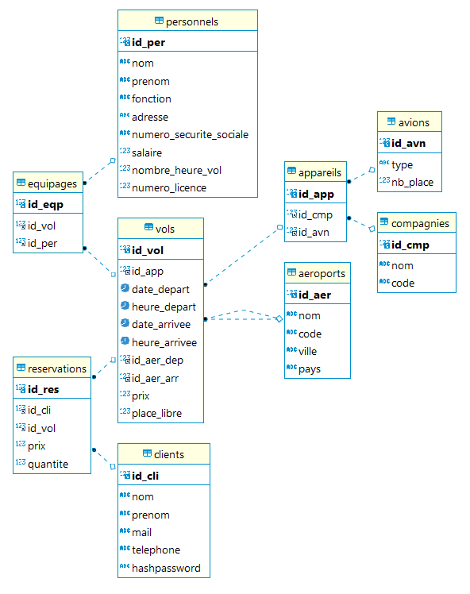

# Systeme de base de données

Ce projet contient l'application web développé par **Maxime Peter** et **Julien Verdun** dans le cadre du cours **Système de base de données**, cours de S9 à l'Ecole Centrale de Lyon.

L'objectif est de créer une application web qui intéragit avec une base de données **MySQL**.

---

## Description du projet

Application permettant la réservation d'un billet d'avion.

---

## Choix des technologies

Le projet a été développé avec des technologies récentes.

Le front-end de l'application est basé sur le framework [ReactJS](https://fr.reactjs.org/).

Le back-end de l'appication a été réalisé en [NodeJS](https://nodejs.org/en/).

Pour respecter le sujet, la base de données est une base [MySQL](https://www.mysql.com/fr/).

En plus de cela, pour simplifier le développement, la librairie [Bootstrap](https://getbootstrap.com/) a été utilisée. Elle fournit un grand nombre d'outils de design simplifiant grandement la création du style de l'application.

Un certain nombre de package Node JS ont été utilisés via le manager de package [npm](https://www.npmjs.com/) ([axios](https://www.npmjs.com/package/axios) pour la liaison entre le front-end et le back-end, etc).

---

## Guide d'installation

### Installation des outils nécessaires

Afin d'utiliser l'application les deux outils suivants devront être installés, assurez vous de les avoir téléchargé avant de continuer l'installation :

- [Node.JS](https://nodejs.org/en/download/)
- [Git](https://git-scm.com/downloads)

Cloner le répertoire [GitHub](https://github.com/Julien-Verdun/database-system-project) dans un répertoire local, appelé par la suite `database-system-project`.

### Installation des dépendances

Le projet dépend de nombreux packages **npm** dont la liste des versions est disponible dans les deux fichiers :

- `database-system-project/Frontend/package-lock.json`
- `database-system-project/Backend/package-lock.json`

Afin d'installer les packages nécessaires :

- ouvrir un invité de commande et se placer au niveau du répertoire `database-system-project/Frontend` et exécuter la ligne de commande :

```
npm install
```

Réaliser la même opération dans le répertoire `database-system-project/Backend`.

Le gestionnaire de package **npm** va se charger d'installer la bonne version des packages nécessaires au bon fonctionnement de l'application.

### Création de la base de données

Dans le repertoire `database-system-project/Backend/database_creation`, créez un fichier `database_connection.js` avec le contenu suivant :

```
const databaseParams =
  {
    databasePwd : "votre_mot_de_passe",
    host : "localhost",
    user : "root"
  };

module.exports = {
  databaseParams
};
```

Prenez soin de renseigner le mot de passe de votre instance mysql en lieu et place de **votre_mot_de_passe**.

/!\ /!\ /!\ Si votre instance MySQL n'a pas été créée avec les paramètres **host** et **user** localhost et root, prenez soin de les remplacer par leurs valeurs.

Ces paramètres nous permettent de nous connecter à notre base de données locale.
Nous allons maintenant nous y connecter et générer une base de données contenant quelques données.

Pour ce faire, ouvrez un invité de commande, placez-vous au niveau du répertoire `database-system-project/Backend/database_creation` et exécutez successivement les lignes de commande :

```
node create_database.js
```

puis :

```
node feed_database.js
```

Une base de données MySQL portant le nom **mydb** est créée et contient les tables, les relations, et quelques données nécessaires à la manipulation de l'application.

---

## Lancement local de l'application

Afin de lancer en local la partie back-end de l'application, ouvrez un invité de commande, placez-vous au niveau du répertoire `database-system-project/Backend` et exécutez la ligne de commande :

```
npm start
```

Le serveur NodeJS se lance et écoute sur le port 8080.

Afin de lancer en local la partie front-end de l'application, ouvrez un invité de commande, placez-vous au niveau du répertoire `database-system-project/Frontend` et exécutez la ligne de commande :

```
npm start
```

Si cela ne se fait pas de manière automatique, ouvrez ensuite un navigateur internet, de préférences **Google Chrome**, sur le port `http://localhost:3000/`. L'application est prête à utilisation.

---

## Description de l'application

### Structure de la base de données

La figure suivante, obtenue avec le logiciel **DBeaver**, représente les différentes tables de la base de données.

Les liens entre les tables, les clés primaires et les autres clés sont également représentés.



La **base de données** est composée de 7 tables.

Les tables **avions** et **compagnies** contiennent les informations relatives aux avions (type d'avion, nombre de place) et aux compagnies aériennes.
Elles sont liées par la table **appareils** qui permet de connaître les avions possédés par chaque compagnie aérienne.

Une table **aeroports** contient les données des aéroports et une table **clients** les données des passagers.

Les vols sont stockés dans une table **vols**. Elle est aux tables **appareils** et **aeroports** et permet ainsi de connaître avec quel appareil (avion et compagnie) le vol sera réalisé, de quel aéroport le vol partira et dans quel aéroport le vol atterira, mais également des informations relatives au prix du billet, au nombre de place disponible et aux horaires de départ et d'arrivée.

Finalement, la table **reservations** fait le lien entre les tables **clients** et **avions** et permet de connaître les vols qu'ont réservé les clients, où les passagers de chaque vols, ainsi que le prix payé par chaque passager.

### Génération de la base de données

La base de données est générée et remplie de manière automatique, afin de fournir une base suffisament fournit pour manipuler l'application.

Pour ce faire, les tables **avions**, **compagnies**, **appareils** et **aeroports** sont remplies avec un certain nombre de données.

Les tables **vols**, **clients** puis **reservations** sont ensuite remplies avec des données générées aléatoirement, et ce, avec un minimum de cohérence.
Ainsi, il est probable des incohérences dans les données mais cela n'a que peu d'importance puisqu'elles sont là uniquement à titre démonstratif.

### Les liens entre les tables

La modification, l'ajout ou la suppression de données dans la base nécessite de prendre certaines précautions.

En effet, si par exemple on réserve un vol avec un passager, il faut penser à modifier plusieurs tables. Il faut tout d'abord ajouter une ligne dans la table réservation qui va lier le passager et le vol qu'il a réservé. Il faut dans le même temps penser à retrancher au vol le nombre de places réservées.

De même, si l'on décide de supprimer un avion avec l'administrateur pour une quelconque raison, cela implique plusieurs tables. L'avion est sans doute relié à plusieurs appareils (avion et compagnie), et ces appareils sont peut-être assignés à des vols, que des clients auraient déjà réservés. Il faut prendre soin de supprimer les réservations, puis les vols, puis les appareils puis finalement l'avion concerné.

Un dernier exemple, lorsque l'on souhaite supprimer un aéroport, il faut prendre soin de supprimer, en premier lieu, l'ensemble des vols dont l'aéroport de départ ou l'aéroport d'arrivée sont l'aéroport en question.

## L'application

On accède à l'application par une **page de connexion**. L'utilisateur doit fournir un identifiant de connexion (une adresse email) ainsi qu'un mot de passe de connexion.

Il n'est pas possible de créer un compte, cette fonctionnalité n'a pas été ajoutée au projet.

La **sécurité de l'application** est assurée par le hashage des mots de passe. Le mot de passe n'est jamais stocké en clair dans la base de données, seul le hash du mot de passe est stocké pour chaque utilisateur. Pour des raisons de simplicité, les mots de passes de tout les utilisateurs sont les mêmes : **sbdappmdp\*\***.
Ainsi, lorsque l'utilisateur soumet son mot de passe pour se connecter, celui-ci est hashé et le hash du mot de passe soumis est comparé au hash du mot de passe en base, ainsi, à aucun moment le mot de passe ne circule sur le réseau, pour assurer l'intégrité du mot de passe de l'utilisateur.

Une fois l'utilisateur connecté, celui-ci peut accéder aux différentes pages de l'application et naviguer entre elles.

L'application est structurée de la sorte :

- un **header** : il contient la barre de naviagtion de l'application avec la possibilité de se rendre sur la page d'accueil, d'accéder aux réservations de l'utilisateur, de réserver un vol, d'accéder au profil de l'utilisateur, d'accéder au menu de management des données pour l'utilisateur admin et finalement de se déconnecter

- la **page principale** : c'est l'endroit où les différentes pages de l'application sont affichées et permettent à l'utilisateur de naviguer

- un **footer** : il contient des informations inutiles pour l'application.


Les pages principales de l'application sont les suivantes :

- la **page d'accueil** :
- le **système de management des données** : accesssible uniquement par l'administrateur, cette page permet de visualiser le contenu des différentes tables vols, appareils, avions, compagnies, aeroports et clients. L'administrateur peut insérer des élèments dans ces tables ou en supprimer
- la page **mes réservations** : l'utilisateur accède sur cette page aux réservations qu'il a pu effectuer
- la page de **réservation d'un vol** : l'utilisateur peut choisir la date de son voyage et les aéroports de départ et d'arrivée, et voir les vols correspondant à sa rechercher, puis choisir un vol pour le réserver
- le **profil utilisateur** : cette page contient les informations de l'utilisateur
- la page **réservation** : elle représente le détail d'un vol et permet selon son utilisation de le réserver avec une quantité choisie ou d'annuler la réservation.

# TODO

- rendre les vols complets quand plus de place disponible (menu management et flightsearch)
- dans les recherches de vol, proposer aussi les vols précédents ou suivants
  et ajouter la ville et le pays dans le choix de l'aeroport (Maxime)

BDD :

- ajouter une procédure à la base de donneés (Maxime)
- ajouter un trigger à la base de donneés

Compte-rendu (MaximePeter_JulienVerdun_gr2.zip)

- description du cahier des charges (a l'image de celui dans la description des projets), cahier des charges (Maxime)
- infrastructure proposée: machines, logiciel, réseau; (Maxime)

- creation BDD : verifier que la somme des nb places ne depasse pas le total
